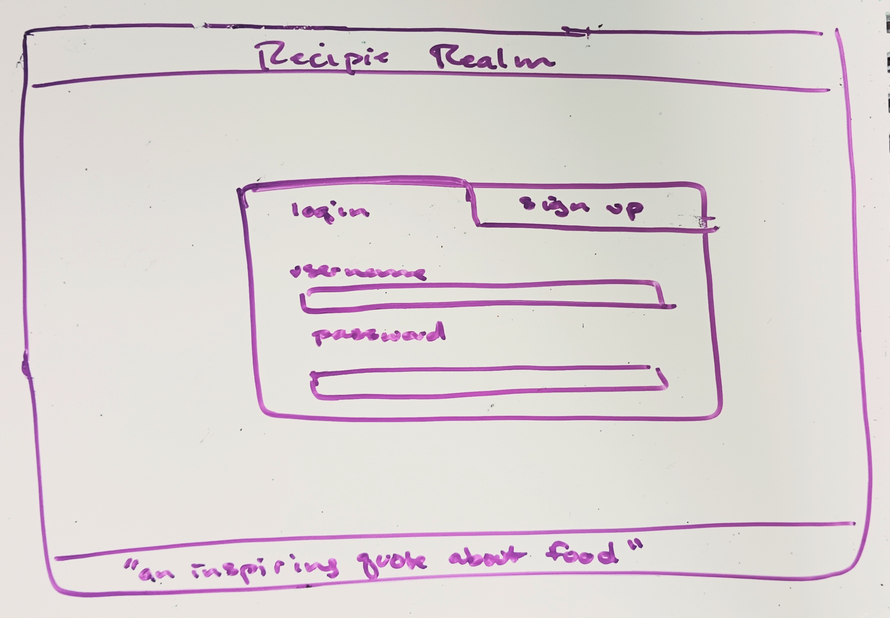
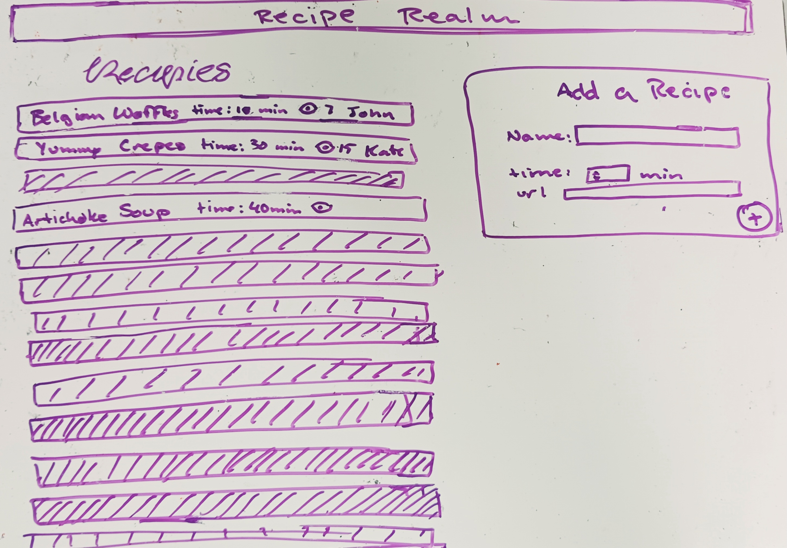

# Recipe Realm
A web-based recipe sharing app  

## Specification Deliverable

### Elevator Pitch
When was the last time you needed inspiration for dinner, and opened a recipe book? Probably not recently. But, when was the last time you searched the internet, or looked through your old emails or text messages, for just the right recipe? Probably recently. Recipe Realm is the perfect balance, providing an easy way to organize, access, and share your favorite online recipes. When you find a winning dish, or when your friend sends you a delicious delicacy they made recently, just add it to Recipe Realm, and soon you will have meal ideas for every occasion at your fingertips

### Design

### Key Features
- Secure Login with HTML
- Add new recipes to the list
- Each recipe in the list links to an external web page
- Updates in real-time the total number of "views" on each recipe
- Ability to delete recipes that you added

### Technologies
I am going to use the required technologies in the following ways:

- **HTML** - Uses correct HTML structure. Two HTML pages. One for login and one for recipe viewing and adding. Button list items that hyperlink to external pages.
- **CSS** - Application styling that looks good on different screen sizes, uses good whitespace, color choice, and contrast.
- **JavaScript** - Provides login, recipe list display, recipe-adding capability, backend endpoint calls.
- **Service** - Backend service with endpoints for:
  - login
  - retrieving recipes
  - uploading new recipes
  - retrieving a random inspiring quote about food
- **DB/Login** - Store users, recipes uploaded by each user, views per recipe, and basic recipe information in the database. Register and log in users. Credentials are securely stored in the database. Cannot add recipes unless authenticated.
- **WebSocket** - When a recipe is viewed, the recipe's views count increases and the recipe owner receives a notification.
- **React** - Application ported to use the React web framework.

## HTML Deliverable
- **HTML Pages -** there are three pages: a login page, a home page, and an add recipes page which connect by links in the nav bar
- **DB/Login -** input boxes and submit button for login. Recipe options are stored on and pulled from the database. A random food quote on the add a recipe page is retrieved from the database.
- **Input** - on the add a recipe page user input is accepted using dropdown selection, number input, URL, and text, in order to build the recipe page
- **Links -** there are links to each page and links that open new tabs to looks at recipes that have been added
- **Image -** A thematic food image is displayed on the login screen
- **Websocket -** notifications pop up in real-time when users add recipes, and recipe view counts are tallied/updated in real-time

## CSS Deliverable 
- **Prerequisite:** A link to my GitHub startup repository in the footer of every page
- **Header, footer, and main content body.** Used flex to layout sections.
- **Navigation elements** in the navbar at the top. The current page displays as an active link.
- unfinished: **Responsive** to window resizing.
- **Application elements.** Buttons, forms, containers, and cards are done using bootstrap. Spacing is aesthetically pleasing
- unfinished: **Application text** content is consistent, using the default bootstrap font
- **Application images.** The background of every page has an image overlayed
- **3rd party service call placeholder** at the bottom of the form on the "add a recipe" page
<!--
## JavaScript Deliverable
## Service Deliverable
## DB/Login Deliverable
## WebSocket Deliverable
## React Deliverable
-->
